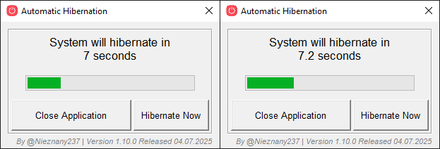

# Automatic Hibernation

This is a simple Python application using Tkinter to automatically hibernate a Windows system after a countdown. It also includes a manual hibernation option.



## Features
- Checks if the system supports hibernation
- Displays a countdown with a progress bar
- Allows immediate hibernation via a button
- Simple graphical interface

## Requirements
- Windows OS (with hibernation enabled)
- Python 3.11 or later
- Tkinter
- [hPyT](https://github.com/Zingzy/hPyT)

## Installation
1. Download the source code from the repository.
2. Make sure you have the correct version of Python installed.
3. (Optional) Create and activate a virtual environment:
   ```powershell
   python -m venv venv
   .\venv\Scripts\Activate.ps1
   ```
4. Install the required packages:
   ```powershell
   pip install -r requirements.txt
   ```
5. Run the Python script:
   ```powershell
   python Main.py
   ```

## Usage
- When the application starts, a countdown to hibernation begins.
- You can manually hibernate by clicking the **Hibernate Now** button.
- You can close the application before hibernation using the **Close Application** button.

## License
This project is licensed under the MIT License.
